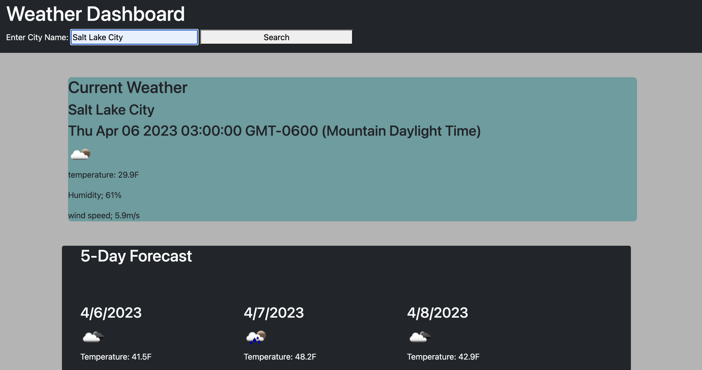
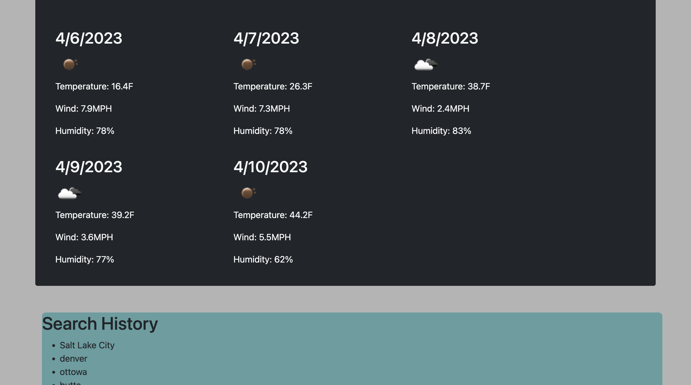

# 5-day-weather-forcast

## Description

This weather forecast application is a great solution to quickly and accurately search for live weather, as well as get a 5 day forecast for any given city in 
the US with a simple search input, I was motivated to build this project to sharpen my knowledge on using third party API's while providing something useful. As well as further showing my ablilities to store relavent information on a user's local machine using local storage. Initial problems that I ran into were creating new elements based off of the data gained via API call. I overall learned how to successfully and efficiently make an api call and store the gained info, and displaying relevant, specific information to populate a given area on the HTML.

## Installation

This project is deployed on Github pages and needs no further installation from the user. Everything is handled in the browser.

## Usage

When the user navigates to this project on their browser, in the "Enter City Name" input box, user can then enter a city name. In which the weather for that day will be displayed first and foremost, followed by a 5 day forecast of that same city. If the user then searches a different city, the page will then show that same information for the new city, but every previously searched city will still be listed below all of the weather information in a "Search History" section.

## License

MIT License information can be found in the LICENSE file associated with this project.
